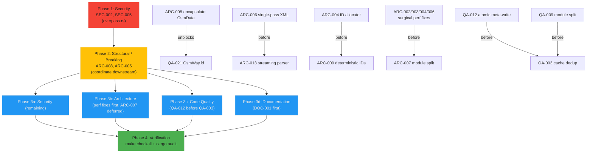

# Project Audit Report

> **Project**: par-osm-rust
> **Date**: 2026-07-17
> **Stack**: Rust (Edition 2024, MSRV 1.87) — shared library crate (`par_osm_rust` 0.1.1, ~6,000 LOC, 10 source files)
> **Audited by**: Claude Code Audit System (four parallel expert agents: Architecture, Security, Code Quality, Documentation)

---

## Executive Summary

`par-osm-rust` is a **healthy, well-engineered library crate** in a stronger state than its 0.1.x version implies. It has a clear single purpose (OpenStreetMap + SRTM fetch/parse/cache for downstream crates `osm-to-bedrock` and `osm-world`), **116 passing tests with zero `unwrap`/`expect`/`panic!` in production code**, a clean `clippy -D warnings`, defense-in-depth SSRF protection on the Overpass path, atomic write-then-rename cache discipline, and genuinely excellent documentation (README + ARCHITECTURE.md with Mermaid diagrams + a style guide). There are **no correctness bugs and no Critical security or architecture failures.**

The work that matters is concentrated, not scattered. Three themes account for the bulk of the High findings:

1. **Three quadratic/doubled-work walls on the fetch-critical path** — O(n²) POI dedupe, O(n²) way-ID reverse lookup in the XML writer, and a two-pass XML parser. These were independently flagged by *both* the Architecture and Code Quality agents (high confidence) and will make the crate unusably slow exactly in the dense urban areas the downstream Minecraft generators target.
2. **Structural debt in the two largest modules** — `overture.rs` (1,473 LOC) and `osm.rs` (1,159 LOC) bundle unrelated concerns, and `OsmData`'s `ways_by_id` invariant is maintained by hand with all-`pub` fields. ~200 lines of cache logic are duplicated between `osm_cache` and `overture`.
3. **Two security hardening gaps that undermine otherwise-excellent controls** — the `reqwest` client follows redirects by default (bypassing the URL allowlist), and a live API token sits in `.claude/settings.local.json`.

**Estimated effort:** the two High security fixes and the three perf fixes are each small (tens of lines) and high-leverage; together they are roughly a 1–2 day sprint. The structural refactors (module split, `OsmData` encapsulation, cache dedup) are larger and some are breaking for downstream — sequence those after the surgical wins and coordinate with `osm-to-bedrock`/`osm-world`.

**Top strength:** the testability design. `sources::fetch_map_data_with_fetchers` injects the OSM/Overture fetch functions as generic parameters, cleanly separating the pure `merge_source_data` from side-effecting orchestration — exemplary for a Rust network crate.

### Issue Count by Severity

| Severity | Architecture | Security | Code Quality | Documentation | Total |
|----------|:-----------:|:--------:|:------------:|:-------------:|:-----:|
| 🔴 Critical | 0 | 0 | 0 | 1 | **1** |
| 🟠 High     | 8 | 1 | 3 | 3 | **15** |
| 🟡 Medium   | 8 | 0 | 9 | 5 | **22** |
| 🔵 Low      | 5 | 11 | 9 | 7 | **32** |
| **Total**   | **21** | **12** | **21** | **16** | **70** |

> **Security note (post-audit correction):** the Security agent originally rated **SEC-001** (live API token in `.claude/settings.local.json`) as **High**. The orchestrator independently verified via `git check-ignore` that the file **is already ignored** by the user's *global* gitignore (`~/.config/git/ignore` → `**/.claude/settings.local.json`), is untracked, and has never been committed. It is therefore **not** exposed via normal `git add` (would require `git add -f`). SEC-001 is **reclassified to Low** (defense-in-depth only). The corrected counts above reflect this; see SEC-001 for details.

---

## 🔴 Critical Issues (Resolve Immediately)

### [DOC-001] README quickstart pins a stale crate version (`0.1.0`)
- **Area**: Documentation
- **Location**: `README.md:14`
- **Description**: The dependency snippet declares `par-osm-rust = "0.1.0"`, but `Cargo.toml:3` is `version = "0.1.1"`. The release commit `072c5b2` bumped the manifest without updating the README.
- **Impact**: Anyone copying the snippet pins the older published release and misses the 0.1.1 dependency upgrades (quick-xml 0.39→0.41, reqwest 0.12→0.13, sha2 0.10→0.11). Trivial to fix, high reader impact.
- **Remedy**: Change line 14 to `par-osm-rust = "0.1.1"`, or — per the project's own style guide (`docs/DOCUMENTATION_STYLE_GUIDE.md:222-240`, "Avoid duplicating dependency versions") — remove the version literal entirely so it can't drift again. Land before the next crates.io publish.
- **Files Affected**: `README.md`

---

## 🟠 High Priority Issues

### [SEC-002] Overpass `reqwest` client follows redirects, bypassing the SSRF host allowlist
- **Area**: Security
- **Location**: `src/overpass.rs:155-157` (`Client::builder()`), `:174-185` (`build_overpass_request`)
- **Description**: `validate_overpass_url` correctly enforces HTTPS + an approved-host allowlist + no userinfo (well-tested at `:384-422`). But the client is built without a redirect policy, so reqwest applies its default of following up to 10 redirects — and validation only runs against the *initial* URL. A compromised or open-redirect allowlisted mirror can return `302 → http://169.254.169.254/...` or an internal RFC-1918 host, and the body is returned to the caller.
- **Impact**: An attacker controlling an allowlisted Overpass mirror can redirect the POST to an internal endpoint and surface its response (or the error body — see SEC-005) into the application. The five allowlisted hosts are all third-party-run.
- **Remedy**: Set `.redirect(reqwest::redirect::Policy::none())` on the client builder and treat any 3xx as an error. If legitimate mirror load-balancing requires redirects, use `Policy::custom` to re-run `validate_overpass_url` on every hop.
- **Files Affected**: `src/overpass.rs`
- **Blocking Notes**: Shares its edit with SEC-005 (same `fetch_osm_xml`). Land before any Code Quality Overpass retry/backoff refactor (same `Client::builder()` call).

### [ARC-001] Overture GeoJSON cache has no version/TTL awareness — stale data served forever
- **Area**: Architecture
- **Location**: `src/overture.rs:769-774` (`overture_cache_key`), `:735-817` (cache R/W)
- **Description**: The cache key is `SHA256("overture|{bbox}|{cli_type}")` — it omits the `overturemaps` CLI version, the Overture data release, and any TTL. Once written, an entry is reused until manually cleared.
- **Impact**: Downstream consumers silently receive stale POI/building data on every re-run; a CLI output-schema change combined with a stale cache produces an `OsmData` that reflects the old schema under new code expectations. Users must know to call `clear_overture_cache(None)`.
- **Remedy**: Add `cli_version` (probe `overturemaps --version` once at start) and an optional data-release/TTL to `OvertureCacheMeta` and fold them into the key. Default TTL ~30 days, overridable via `OvertureParams`.
- **Files Affected**: `src/overture.rs`
- **Blocking Notes**: Blocks any QA test asserting Overture freshness. Land before ARC-009 (counter refactor) — both touch the cache/parse boundary.

### [ARC-002] O(n²) POI deduplication — scaling wall for dense urban areas
- **Area**: Architecture (cross-validated by Code Quality as **QA-002**)
- **Location**: `src/sources.rs:148-165` (`dedupe_pois_with_overture_preference`), called from `:221`, `:243`
- **Description**: Nested loop: for each POI, scan every already-kept POI and call `poi_duplicates` (which allocates 4 `String`s per pair via `poi_category` + `normalized_name`, plus a haversine). Pure quadratic with heavy allocation.
- **Impact**: A city-center fetch returning 30k–80k POIs is billions of comparisons and multi-second CPU on the merge critical path — exactly where downstream apps call from a UI thread.
- **Remedy**: Spatial bucketing (snap each POI to a ~25 m grid key, compare only within the cell and its 8 neighbors) → O(n·k). Rewrite `poi_duplicates` to borrow instead of allocating. See QA-014.
- **Files Affected**: `src/sources.rs`
- **Blocking Notes**: Fix together with QA-014 (same hot loop).

### [ARC-003] O(n²) reverse way-ID lookup in `write_osm_xml_string`
- **Area**: Architecture (cross-validated by Code Quality as **QA-001**)
- **Location**: `src/osm.rs:773-779`
- **Description**: For each way index, the writer linear-scans the entire `ways_by_id` HashMap with `iter().find_map(...)`. O(W²). Root cause: `OsmWay` has no `id` field, so the ID must be recovered from the inverse map.
- **Impact**: Serializing a 100k-way urban extract is ~10¹⁰ map iterations on the write path downstream apps use to persist normalized data.
- **Remedy**: Build a one-shot inverse `HashMap<usize, i64>` before the loop and look up each index in O(1). (Cleaner long-term fix: add `id: i64` to `OsmWay` — see QA-021 / ARC-008 — but that's breaking.)
- **Files Affected**: `src/osm.rs`
- **Blocking Notes**: Minimal fix is independent. If QA-021 (id-on-OsmWay) lands, this lookup becomes unnecessary.

### [ARC-004] Divergent synthetic-ID schemes with magic-number ranges
- **Area**: Architecture (related: QA-013)
- **Location**: `src/osm.rs:711-719, 744, 778, 788`; `src/overture.rs:145-150`
- **Description**: Two independent synthetic-ID allocators. The XML writer uses hardcoded magic offsets (`-9_000_000_000` nodes, `-8_000_000_000` ways, `-7_000_000_000` relations); Overture parsing uses a process-global atomic starting at `-1_000_000_000`. The non-overlap contract is implicit and untested.
- **Impact**: A future change to either allocator's base can silently produce ID collisions, corrupting `ways_by_id`/`nodes` (last-write-wins) and breaking relation resolution with no compile-time signal.
- **Remedy**: Centralize in a `synthetic_ids` module — named constants, a single allocator type used by both the writer and the Overture parser, and a `const _: () = assert!(...)` test that the ranges don't overlap.
- **Files Affected**: `src/osm.rs`, `src/overture.rs`, (new `src/synthetic_ids.rs` or section)
- **Blocking Notes**: Blocks ARC-009 (both touch the allocator). Land before ARC-007 (module split).

### [ARC-005] Hidden migration side effect on every cache-dir lookup
- **Area**: Architecture (related: QA-008)
- **Location**: `src/cache.rs:46-86` (`overpass_cache_dir`, `srtm_cache_dir`, `overture_cache_dir`), `:122-131` (`migrate_legacy_cache_dir_if_default`)
- **Description**: Each `*_cache_dir()` getter calls `migrate_legacy_cache_dir_if_default(...)` on every invocation. Steady-state cost is one `stat`, but the side effect is invisible and surprising: a function named like an accessor may move files. First-call behavior is also non-idempotent under concurrent callers (two threads race on `fs::rename`).
- **Impact**: (a) surprising implicit I/O in accessor-shaped functions; (b) undocumented race between concurrent first-callers; (c) every module touching a cache dir transitively depends on the legacy layout.
- **Remedy**: Make `*_cache_dir()` pure path resolution; expose `migrate_legacy_caches() -> Result<MigrationReport>` (already exists at `:89`) as the explicit entry point and require downstream apps to call it once at startup (README already implies this).
- **Files Affected**: `src/cache.rs`, `README.md`, `docs/ARCHITECTURE.md`, downstream consumers
- **Blocking Notes**: **Breaking behavioral change for `osm-to-bedrock` and `osm-world`** — they rely on implicit migration. Coordinate before landing.

### [ARC-006] Two-pass XML parser doubles CPU on large Overpass responses
- **Area**: Architecture
- **Location**: `src/osm.rs:364-669` (`parse_osm_xml_str`)
- **Description**: The whole XML string is tokenized twice (`Reader::from_str` at `:381` for nodes, `:540` for ways/relations) because Overpass doesn't guarantee node-before-way ordering. But node *positions* aren't needed to collect way/relation structure — only the way member references need the node map, and that resolves at consumer time.
- **Impact**: A 50–100 MB Overpass response parses at ~2× the necessary CPU/memory, on every fetch's critical path.
- **Remedy**: Single-pass parse collecting nodes, ways, and relations in one `read_event` loop; defer node-position resolution to consumers.
- **Files Affected**: `src/osm.rs`
- **Blocking Notes**: Land before ARC-013 (streaming-from-disk) — they share the parser rewrite.

### [ARC-007] Module SRP violations — `overture.rs` and `osm.rs` are multi-concern mega-modules
- **Area**: Architecture (related: QA-009)
- **Location**: `src/overture.rs` (1,473 LOC, ~8 concerns), `src/osm.rs` (1,159 LOC, ~4 concerns)
- **Description**: `overture.rs` bundles theme types, CLI availability, CLI subprocess invocation, GeoJSON normalization, tag mapping, Overture cache R/W/meta/list/clear, and high-level fetch orchestration. `osm.rs` bundles the data model, PBF parsing, XML parsing, and XML serialization.
- **Impact**: Poor navigability, slow incremental compiles, hard-to-isolate testing; the CLI plumbing is `pub` though only `fetch_overture_data` should call it.
- **Remedy**: Split `overture.rs` → `overture/{theme,cli,parse,cache,mod}.rs`; split `osm.rs` → `osm/{model,pbf,xml_parse,xml_write,mod}.rs`. Keep public re-exports at original paths so downstream is unaffected.
- **Files Affected**: `src/overture.rs`, `src/osm.rs`, `src/lib.rs`
- **Blocking Notes**: **Largest blast radius.** Per expert sequencing, land **after** the surgical perf fixes (ARC-002/003/004, ARC-006) — reorganizing first just spreads existing debt across more files. Deferred to post-Phase-3.

### [ARC-008] `OsmData` has no encapsulation; `ways_by_id` invariant is manually maintained
- **Area**: Architecture (related: QA-015, QA-021, ARC-016)
- **Location**: `src/osm.rs:65-85` (all fields `pub`), `:89-111` (`merge`), `:127-165` (`clip_to_bbox`), `:145-162` (defensive "shouldn't happen, but be safe" scan)
- **Description**: `ways_by_id` is a hand-maintained index into the `ways` Vec; every mutation site (merge, clip, parse, write, Overture normalization) must keep them in sync. The `:145` comment ("shouldn't happen, but be safe") shows the invariant has already shown fragility. All-`pub` fields let any code construct an inconsistent `OsmData`.
- **Impact**: Silent corruption when a future code path mutates `ways` without updating `ways_by_id` — ways become unfindable for relation resolution and get dropped on `clip_to_bbox`. No compile-time enforcement.
- **Remedy**: Make fields `pub(crate)`/private; expose `push_way`, `iter_ways`, `way_id_at`, `OsmData::new`. At minimum add a `validate_invariants(&self)` called in debug builds/tests. Breaking for downstream — gate behind a version bump.
- **Files Affected**: `src/osm.rs`, downstream if they construct `OsmData` directly
- **Blocking Notes**: **Breaking API change** — coordinate. Unblocks clean fixes for ARC-003/QA-001/QA-021.

### [QA-003] Cache read/write/list/clear logic duplicated between `osm_cache` and `overture`
- **Area**: Code Quality
- **Location**: `src/osm_cache.rs:170-296` vs `src/overture.rs:777-918`
- **Description**: `read_from`↔`overture_cache_read`, `write_to_with_overpass_url`↔`overture_cache_write`, `list_areas_in`↔`list_overture_areas`, `clear_dir`↔`clear_overture_cache_dir` are structurally identical (~200 lines), differing only in extension (`.xml`/`.geojson`) and metadata struct. They've already drifted slightly.
- **Impact**: Any fix to the cache write protocol (e.g. QA-012's non-atomic data+meta write) must be applied twice.
- **Remedy**: Extract a generic `RawCache<Meta: Serialize + DeserializeOwned>` helper (`src/cache_store.rs`), keep public functions as thin wrappers to preserve the API.
- **Files Affected**: `src/osm_cache.rs`, `src/overture.rs`, (new `src/cache_store.rs`)
- **Blocking Notes**: Run **after** QA-009 (module split) and **after** QA-012 (atomic-write fix), so one correct protocol is extracted.

### [DOC-002] No CHANGELOG.md or release notes
- **Area**: Documentation
- **Location**: Missing (repo root)
- **Description**: No `CHANGELOG.md`/`CHANGES.md`/GitHub Releases. The 0.1.0→0.1.1 changes (quick-xml `normalized_value` migration, reqwest/sha2 bumps, Makefile) are reconstructable only from `git log`. The publish workflow publishes silently with no changelog step.
- **Impact**: Downstream consumers can't see what changed between releases, including transitive-dep-affecting upgrades.
- **Remedy**: Add `CHANGELOG.md` (Keep-a-Changelog format); backfill `[0.1.1]` and `[0.1.0]`. Optionally assert the changelog has a section for the version being published.
- **Files Affected**: `CHANGELOG.md` (new), optionally `.github/workflows/publish-crates.yml`
- **Blocking Notes**: Land before next publish — otherwise 0.1.x history is permanently lost user-side. Pairs with DOC-001 in a release checklist.

### [DOC-003] No CONTRIBUTING.md
- **Area**: Documentation
- **Location**: Missing (repo root)
- **Description**: No contributor guide. The repo follows Conventional Commits and a `make checkall` gate, but neither is documented; no guidance on adding `OvertureTheme` variants, branch/PR conventions, or the rustdoc style used in `sources.rs`.
- **Impact**: External contributors can't easily contribute; the conventions the project already follows are implicit.
- **Remedy**: Add `CONTRIBUTING.md` covering setup, MSRV, `make checkall`, Conventional Commits, the `sources.rs` rustdoc gold standard, and an end-to-end "add a new OvertureTheme" walkthrough.
- **Files Affected**: `CONTRIBUTING.md` (new)

### [DOC-004] `osm::OsmData::merge` docstring materially understates what gets merged
- **Area**: Documentation
- **Location**: `src/osm.rs:88-89`
- **Description**: The doc says merge "combines nodes, ways, and bounds." The body (`:89-111`) also merges `ways_by_id` (with offset adjustment), `relations`, `poi_nodes`, `addr_nodes`, `tree_nodes`, and unions bounds when both sides have a bbox.
- **Impact**: The central mutation method on the central data type. A caller reading the rustdoc to decide whether merging a partial dataset is "safe" will wrongly conclude POI/address/tree/relation collections stay untouched — can produce visibly wrong map output, not just onboarding friction. Most impactful doc gap.
- **Remedy**: Enumerate every collection merged and the bounds-union semantics in the docstring.
- **Files Affected**: `src/osm.rs`
- **Blocking Notes**: Same file as DOC-005/DOC-006 — do in one pass alongside the `osm.rs` portion of DOC-007.

---

## 🟡 Medium Priority Issues

### Architecture

- **[ARC-009]** Process-global `AtomicI64` synthetic-ID counter makes Overture parsing non-deterministic — two parses of the same GeoJSON yield different IDs. `src/overture.rs:145-150`. *Depends on ARC-004.*
- **[ARC-010]** `OnceLock` in `default_overpass_url` freezes the `OVERPASS_URL` env var at first call; later changes ignored. `src/overpass.rs:71-79`. Document the freeze or read on each call.
- **[ARC-011]** Dual parallel cache APIs in `osm_cache.rs` (legacy `cache_key`/`read`/`write`/`find_containing` + URL-aware `*_for_url`); `find_containing` is `#[allow(dead_code)]`. Deprecate/remove the legacy family (verify downstream usage first).
- **[ARC-012]** No Cargo `[features]` — blocking `reqwest` always pulled in; async-only consumers can't opt out. Add `default = ["blocking"]`, gate fetch modules. `Cargo.toml:19`. *Breaking for downstream.*
- **[ARC-013]** Asymmetric parsing — PBF streams from disk, XML loads fully into memory (`std::fs::read_to_string` then double-tokenize). 200 MB `.osm` ≈ 400 MB peak. Add streaming `parse_osm_xml_file`. `src/osm.rs:672-676`. *Land after ARC-006.*
- **[ARC-014]** CI doesn't verify MSRV (declared 1.87), run `cargo doc`, or run `cargo audit`. MSRV promise is unverifiable; doc breaks caught only on docs.rs; vulnerable transitive deps undetected. `.github/workflows/ci.yml`.
- **[ARC-015]** No `.pre-commit-config.yaml` despite the mandatory gitleaks + detect-private-key + Make-wired-hook policy. Add it per `guides/git-ci.md`.
- **[ARC-016]** OSM XML writer doesn't validate invariants — happily serializes ways referencing absent node IDs (dangling `<nd ref>`); round-trip produces structurally invalid XML. `src/osm.rs:723-803`. *Depends on ARC-008 for the clean fix.*

### Code Quality

- **[QA-004]** Duplicate `Element::Node`/`Element::DenseNode` branches in the PBF parser (~37 lines, byte-identical except binding). `src/osm.rs:220-293`. Extract a `process_node` helper.
- **[QA-005]** Duplicate `Empty`/`Start` event handlers for `<bounds>` and `<node>` in the XML parser (~80 lines). `src/osm.rs:392-477`. Extract attr-parsers.
- **[QA-006]** Triplicated geometry-conversion logic in `parse_overture_geojson` (LineString/Polygon/MultiPolygon, ~70 lines). `src/overture.rs:637-714`. Extract `push_way_from_coords`.
- **[QA-007]** `fetch_overture_data` and `fetch_overture_data_best_effort` are near-duplicates (only error handling differs); already drifted in logging. `src/overture.rs:955-1096`. Extract a per-theme helper.
- **[QA-008]** Cache-dir getters with hidden migration side effects (same root as ARC-005). `src/cache.rs:46-86`.
- **[QA-009]** God-module smell: `overture.rs` (1,099 prod LOC) and `osm.rs` (804 prod LOC). (Same as ARC-007.)
- **[QA-010]** Process-global mutable static for synthetic IDs (same as ARC-009).
- **[QA-011]** `find_containing` is dead public API marked `#[allow(dead_code)]`. `src/osm_cache.rs:299-302`. Delete or drop the allow (check downstream first).
- **[QA-012]** Non-atomic data+meta cache write — between the two renames the cache has a data file with no metadata; a crash leaves an orphan that `read_from` returns but `list_areas` skips. `src/osm_cache.rs:226-242`, `src/overture.rs:802-817`. Write meta first, finalize data last. *Land before QA-003.*

### Documentation

- **[DOC-005]** `osm` module-level `//!` doc is out of date ("OSM PBF file parser" only) — omits XML parse/write, the `OsmData` model, merge/clip. `src/osm.rs:1-3`.
- **[DOC-006]** `parse_pbf` docstring understates the return (also returns relations, POIs, addresses, trees, bounds). `src/osm.rs:201-202`.
- **[DOC-007]** `missing_docs` lint not enforced; **39 of 166 public items undocumented (~23%)** — mostly struct fields and enum variants (e.g. `FeatureSource` variants, `OsmData::{nodes,ways}`, `CacheMigrationReport`/`CacheEntry`/`FeatureFilter` fields). Add `#![warn(missing_docs)]` to `src/lib.rs` after backfilling field-by-field.
- **[DOC-008]** README "Verification" section runs weaker than CI (`cargo test` vs `cargo test --all-features`) and never mentions `make checkall`. `README.md:269-277`.
- **[DOC-009]** Several public APIs absent from README (cache list/clear helpers, `ElevationData` lookup, the three parse functions, `ThemePriority`, `OvertureParams.timeout_secs` default).

---

## 🔵 Low Priority / Improvements

### Architecture
- **[ARC-017]** `Cargo.lock` committed for a library crate (against convention). `.gitignore`/`Cargo.lock`.
- **[ARC-018]** No benchmarks for perf-critical parse/dedupe/write paths. Add `criterion` benches.
- **[ARC-019]** No integration tests (all tests are inline unit tests with mocked fetchers). Add `tests/integration.rs` with fixture round-trips.
- **[ARC-020]** `reqwest::blocking::Client` rebuilt on every fetch — no connection pooling. `src/overpass.rs:155-157`, `src/srtm.rs:79-82`.
- **[ARC-021]** CI tests only on `ubuntu-latest` despite Windows `LOCALAPPDATA` code and macOS dev. Add an OS matrix.

### Security
- **[SEC-001]** *(Reclassified High → Low after orchestrator verification.)* Live `ANTHROPIC_AUTH_TOKEN` in `.claude/settings.local.json`. **Verified: the file is ignored** by the global gitignore (`~/.config/git/ignore` → `**/.claude/settings.local.json`), untracked, never committed — so it is **not** reachable via normal `git add` (would need `git add -f`). No active exposure; no urgent rotation required from a git standpoint. Defense-in-depth: still add `.claude/settings.local.json` to the repo `.gitignore` so it's protected on any clone/machine. Files: `.gitignore`.
- **[SEC-003]** SRTM download reuses default redirect policy (no host allowlist, but URL is a hardcoded const + integer-derived tile name, so bounded). Set `Policy::none()` for consistency. `src/srtm.rs:73-95`.
- **[SEC-004]** OSM XML parser has no explicit element-depth limit (quick-xml 0.41 is XXE/billion-laughs-safe by default; depth is the only residual vector). `src/osm.rs:381, 540`.
- **[SEC-005]** *(Promoted into Phase 1 with SEC-002.)* Full Overpass error body surfaced unbounded into the `anyhow` error. `src/overpass.rs:165-169`. Cap the read (reuse the `STDERR_SNIPPET_LIMIT` pattern from `overture.rs:188-205`).
- **[SEC-006]** Cache migration follows symlinks (local data-exfil / OOM via `/dev/zero`-style target); `files_equal` reads both files fully. `src/cache.rs:154-234`. Use `symlink_metadata`, skip symlinks, cap reads.
- **[SEC-007]** `unsafe { std::env::set_var(...) }` in tests under Edition 2024 (env mutation is `unsafe` since 1.85), Mutex-guarded but only serializes this crate's tests. Test-only; consider `temp_env`. `src/overture.rs`, `src/cache.rs`.
- **[SEC-008]** `parse_pbf` memory-maps a caller-supplied path (SIGBUS if truncated/modified concurrently). `src/osm.rs:202-204`. Document file-provenance precondition.
- **[SEC-009]** `.gitignore` doesn't exclude `.env`, `*.pem`, `*.key`, `secrets.*` (global gitignore only covers `.claude/settings.local.json`). Append a standard secrets block + add pre-commit.
- **[SEC-010]** Overture CLI discovery uses PATH lookup (binary-hijack in multi-user setups). The shell-out itself is injection-safe (arg-vector, no shell). `src/overture.rs:161-186`. Document / add `PAR_OSM_OVERTURE_CLI` absolute-path override.
- **[SEC-011]** `validate_overpass_url` accepts arbitrary ports on allowlisted hosts (only hostname compared). `src/overpass.rs:53-64`. Pin 443 or document.
- **[SEC-012]** `fetch_geojson_for_type` accepts an arbitrary `cli_type` `&str` (argument-injection if an external caller passes user input; the crate's own use is safe via enumerated themes). `src/overture.rs:279-339`. Take `OvertureTheme`, or guard against `-`/whitespace, or pass `--`.

### Code Quality
- **[QA-013]** Magic synthetic-ID constants, undocumented and inconsistent across the two allocators (same as ARC-004). `src/osm.rs:744,778,788`, `src/overture.rs:145`.
- **[QA-014]** `poi_category` allocates a `String` on every comparison (×2 per `poi_duplicates`, inside the O(n²) loop). `src/sources.rs:116-125`. Return borrowed slices. *Fix with QA-002.*
- **[QA-015]** `OsmData::merge` silently overwrites on node-ID collision (`HashMap::extend`); currently safe by construction but non-obvious. `src/osm.rs:90`. Document or debug-assert.
- **[QA-016]** `files_equal` loads both files fully into memory (SRTM1 ≈ 25 MB each). `src/cache.rs:222-234`. Stream-compare with early exit.
- **[QA-017]** `default_overpass_url` caches the env-var read permanently (same as ARC-010).
- **[QA-018]** Inconsistent bbox terminology in docs (`(min_lat,min_lon,max_lat,max_lon)` vs `(south,west,north,east)` — same order, different labels). Standardize on `(south, west, north, east)`.
- **[QA-019]** Dual cache-schema versioning (`CACHE_SCHEMA_VERSION=2`, `URL_AWARE_CACHE_SCHEMA_VERSION=3`) is confusing/uncoupled. `src/osm_cache.rs:16-17`.
- **[QA-020]** `platform_cache_root` prefers `HOME` over `LOCALAPPDATA` on Windows (non-standard for native Windows apps). `src/cache.rs:103-111`.
- **[QA-021]** `OsmWay` doesn't carry its own ID (root cause of ARC-003/QA-001). Add `pub id: i64`; breaking. `src/osm.rs:43-46`.

### Documentation
- **[DOC-010]** Doc-comment placement bug — `///` split by `#[derive(...)]` on `OvertureCacheMeta`/`OvertureCacheEntry`. `src/overture.rs:737-739, 819-821`.
- **[DOC-011]** `fetch_overture_data` has a duplicated summary paragraph around its (only) `# Errors` section. `src/overture.rs:936-954`.
- **[DOC-012]** No crate-level `#![doc(html_root_url)]`; docs.rs front page doesn't render the README. `src/lib.rs:1`.
- **[DOC-013]** No rustdoc `# Examples` sections on public items (only one `no_run` doctest in `lib.rs`); README examples aren't exercised by `cargo test --doc`.
- **[DOC-014]** Duplicate `overture_cache_dir` exports (`cache` + `overture`); delegation undocumented. `src/cache.rs:76`, `src/overture.rs:761`.
- **[DOC-015]** `OsmOnly` variant rustdoc is terse vs the README/enum-level description. `src/sources.rs:30`.
- **[DOC-016]** No coverage badge; style-guide-recommended doc checks (markdownlint, lychee link-check, Mermaid validation) not wired into CI.

---

## Detailed Findings

### Architecture & Design
**Health: Good.** Sound foundations, clear purpose, excellent security and testing posture, but accumulating structural debt along three axes: module cohesion (`overture.rs`/`osm.rs` bundle many concerns), performance walls (three quadratic/doubled-work hotspots on the fetch-critical path), and hidden global state (process-wide synthetic-ID counter; per-call legacy-cache rescans). The combination of ARC-002 + ARC-003 + ARC-006 means three independent scaling walls on exactly the urban-scale workloads the downstream generators are built for — fixing those three before any module reorganization is the largest user-visible win. *Confidence: High.* Reviewed all 10 source files, Cargo.toml, Makefile, both CI workflows, ARCHITECTURE.md.

### Security Assessment
**Posture: Good.** A security-aware author: explicit SSRF allowlist (`validate_overpass_url`), atomic cache writes, prior SEC-tracked fixes with comments in `srtm.rs`, SHA-256 hex-encoded cache keys (no path traversal), URL-aware cache isolation (no cross-endpoint poisoning), no command injection in the `overturemaps` shell-out (arg-vector, no shell), no XXE surface (quick-xml defaults), TLS via rustls+ring (no `verify(False)`), all deps current. Remaining work is hardening, with two exceptions that warrant prompt attention: SEC-002 (redirect-following undermines the allowlist) and SEC-001 (token on disk — corrected to Low/mitigated). *Confidence: High.* Note: SEC-001's severity was corrected by the orchestrator after the agent missed the global gitignore.

### Code Quality
**Health: Good — better than the brief implied.** No `tests/` directory, but inline `#[cfg(test)] mod tests` in 9 of 10 files totaling ~2,269 lines / **116 tests + 1 doctest, all passing**; `clippy --all-targets --all-features -- -D warnings` clean; **zero** `unwrap`/`expect`/`panic!` in production code. Debt is concentrated in duplication (cache quartet QA-003; parse branches QA-004/005/006; fetch pair QA-007) and two O(n²) hotspots (QA-001/002), none a correctness problem. Untested areas: real PBF parsing (only XML is exercised), network paths, `write_osm_xml_string` round-trip, `clip_to_bbox`. *Confidence: High.* Agent ran clippy + cargo test for evidence.

### Documentation Review
**Health: Good.** README factual accuracy is excellent (every env var, cache path, default URL, `SourceOptions::default()` value, enum variant, and function signature matches the implementation — only the version literal is stale). `docs/ARCHITECTURE.md` is a strong design doc (Mermaid diagrams, accurate module table matching `src/lib.rs`, security-boundaries + tradeoffs tables). `src/sources.rs` is the rustdoc gold standard (100% coverage). `cargo doc --no-deps` with `-D rustdoc::broken_intra_doc_links` builds clean. Gaps: one Critical stale version (DOC-001), one material rustdoc correctness issue hidden in the central type (DOC-004 — `OsmData::merge`), and standard greenfield omissions (no CHANGELOG, no CONTRIBUTING, `missing_docs` unenforced with ~23% of public items undocumented). *Confidence: High.*

---

## Remediation Roadmap

### Immediate Actions (Before Next Deployment / Publish)
1. **[DOC-001]** Fix the stale `0.1.0` version literal in `README.md:14` (one line; blocks accurate publishes).
2. **[SEC-002] + [SEC-005]** Add `.redirect(Policy::none())` and cap the Overpass error body — one focused edit to `src/overpass.rs`.
3. **[SEC-001] / [SEC-009]** Append a secrets block to `.gitignore` (`.claude/settings.local.json`, `.env`, `*.pem`, `*.key`); add `.pre-commit-config.yaml` with gitleaks. The token is already gitignored globally — no urgent rotation, but close the defense-in-depth gap.

### Short-term (Next 1–2 Sprints)
4. **[ARC-002 / QA-002 + QA-014]** Spatial-grid POI dedupe + borrow-instead-of-allocate comparisons — the single biggest user-visible latency win.
5. **[ARC-003 / QA-001]** One-shot inverse `ways_by_id` map in `write_osm_xml_string`.
6. **[ARC-006]** Single-pass XML parser.
7. **[QA-012]** Fix non-atomic data+meta cache write (write meta first).
8. **[ARC-014]** Add MSRV-check, `cargo doc`, and `cargo audit` jobs to CI.
9. **[DOC-002] / [DOC-003]** Add CHANGELOG.md and CONTRIBUTING.md.
10. **[DOC-004 / DOC-005 / DOC-006]** Correct the `osm.rs` doc drifts in one pass.

### Long-term (Backlog, coordinate with downstream)
11. **[ARC-007 / QA-009]** Split `overture.rs` and `osm.rs` into per-concern submodules (after the surgical perf fixes land).
12. **[QA-003]** Extract the shared `RawCache<Meta>` helper (after the split + QA-012).
13. **[ARC-008]** Encapsulate `OsmData` (breaking; gate behind a version bump; unblocks clean QA-021).
14. **[ARC-005]** Remove implicit migration from cache-dir getters (breaking for downstream; coordinate).
15. **[ARC-012]** Cargo feature flags so async consumers can opt out of blocking `reqwest` (breaking).
16. **[ARC-013]** Streaming XML parser from disk (after ARC-006).
17. **[ARC-018 / ARC-019]** Add `criterion` benches and integration tests to lock in the perf/test gains.

---

## Positive Highlights

1. **Exemplary testability via dependency injection** — `sources::fetch_map_data_with_fetchers` takes the OSM and Overture fetch functions as generic parameters, cleanly separating pure `merge_source_data` from side-effecting orchestration. The right pattern for a Rust network crate.
2. **Best-in-class error handling** — zero `unwrap`/`expect`/`panic!` in production code; every fallible call uses `?`/`.context()`/`.with_context()` with actionable messages ("Overpass is busy — try again in a few minutes", "Install with: pip install overturemaps").
3. **Strong SSRF defense at the URL layer** — `validate_overpass_url` enforces HTTPS, rejects userinfo, and checks an approved-host allowlist; well-tested against the AWS metadata IP, RFC-1918, and userinfo tricks. (Undermined only by the redirect default — SEC-002.)
4. **No command injection** in the `overturemaps` shell-out — `Command::new(...).arg(...).arg(...)` with separate values; the bbox is `format!`-formatted from `f64`s that can't produce shell metacharacters.
5. **Atomic write-then-rename everywhere** caches are written (`osm_cache`, `overture`, `srtm`), eliminating TOCTOU windows for readers/concurrent writers; `srtm.rs` carries an explicit safety comment.
6. **Memory-mapped HGT I/O with a correct safety contract** — `elevation.rs` mmaps tiles lazily so a 25 MB SRTM1 tile pages in only queried rows, with a thorough `unsafe`-block justification.
7. **SHA-256 hex cache keys + URL-aware isolation** — no path traversal via cache keys; entries written for one Overpass mirror can't be served for another.
8. **Outstanding documentation** — ARCHITECTURE.md with Mermaid diagrams, a documentation style guide, thorough cross-referenced rustdoc, and a README with copy-pasteable, implementation-accurate examples.

---

## Audit Confidence

| Area | Files Reviewed | Confidence |
|------|---------------|-----------|
| Architecture | 17 (all src + Cargo.toml, Makefile, both CI workflows, ARCHITECTURE.md) | High |
| Security | 17 (all src + Cargo.toml, Cargo.lock, .gitignore, both workflows, settings.local.json) | High |
| Code Quality | 11 src files + Cargo.toml, Makefile, ci.yml (ran `cargo clippy` + `cargo test`) | High |
| Documentation | README, both docs/, all src, both workflows, style guide (ran `cargo doc --no-deps`) | High |

*Methodology note: par-mem code-memory MCP tools were not registered this session, so all four agents relied on direct Glob/Grep/Read plus `cargo`/`git` introspection. The orchestrator independently verified the highest-stakes claim (SEC-001) and corrected it. Two findings were independently surfaced by both Architecture and Code Quality (ARC-002↔QA-002, ARC-003↔QA-001) and several others converged (ARC-005↔QA-008, ARC-009↔QA-010, ARC-010↔QA-017, ARC-011↔QA-011) — high-confidence signal. Line numbers may drift if files are edited before remediation; re-`Read` before fixing.*

---

## Remediation Plan

> This section is generated by the audit and consumed directly by `/fix-audit`.
> It pre-computes phase assignments and file conflicts so the fix orchestrator
> can proceed without re-analyzing the codebase.

### Phase Assignments

#### Phase 1 — Security (Sequential, Blocking)
<!-- The High-severity security issues on the most contended file (overpass.rs). SEC-005 is Low
     but promoted here because it shares the exact same edit as SEC-002. No Critical security
     issues were found. -->

| ID | Title | File(s) | Severity |
|----|-------|---------|----------|
| SEC-002 | Overpass client follows redirects, bypassing SSRF allowlist | `src/overpass.rs` | High |
| SEC-005 | Full Overpass error body surfaced unbounded | `src/overpass.rs` | Low |

#### Phase 2 — Architecture: Structural / Breaking (Sequential; coordinate with downstream)
<!-- No Critical architecture issues. Phase 2 holds the structural changes that unblock cleaner
     Code Quality fixes or are breaking for downstream. ARC-007 (module split) is intentionally
     NOT here — per expert sequencing it lands after the Phase 3 surgical perf fixes. -->

| ID | Title | File(s) | Severity | Blocks |
|----|-------|---------|----------|--------|
| ARC-008 | Encapsulate `OsmData`; enforce `ways_by_id` invariant | `src/osm.rs` | High | clean QA-021, QA-001, ARC-016 |
| ARC-005 | Remove implicit migration from cache-dir getters | `src/cache.rs`, `README.md`, `docs/ARCHITECTURE.md` | High | (downstream behavior change) |

#### Phase 3 — Parallel Execution
<!-- All remaining work, safe to run concurrently by domain. Heavily-contended files
     (osm.rs, overture.rs, cache.rs, overpass.rs, sources.rs) appear in multiple domains —
     see File Conflict Map and coordinate/sequence within-file edits. -->

**3a — Security (remaining)**
| ID | Title | File(s) | Severity |
|----|-------|---------|----------|
| SEC-001 | Token in `.claude/settings.local.json` (already gitignored globally) | `.gitignore` | Low |
| SEC-003 | SRTM redirect policy | `src/srtm.rs` | Low |
| SEC-004 | XML element-depth limit | `src/osm.rs` | Low |
| SEC-006 | Cache migration symlink following + unbounded `files_equal` | `src/cache.rs` | Low |
| SEC-007 | `unsafe set_var` in tests (Edition 2024) | `src/overture.rs`, `src/cache.rs` | Low |
| SEC-008 | `parse_pbf` mmap of caller path (document precondition) | `src/osm.rs` | Low |
| SEC-009 | `.gitignore` secrets block + pre-commit | `.gitignore`, `.pre-commit-config.yaml` | Low |
| SEC-010 | Overture CLI PATH-lookup (document / absolute-path override) | `src/overture.rs` | Low |
| SEC-011 | Overpass port not pinned | `src/overpass.rs` | Low |
| SEC-012 | `fetch_geojson_for_type` arbitrary `cli_type` | `src/overture.rs` | Low |

**3b — Architecture (remaining)**
| ID | Title | File(s) | Severity |
|----|-------|---------|----------|
| ARC-001 | Overture cache lacks version/TTL | `src/overture.rs` | High |
| ARC-002 | O(n²) POI dedupe (spatial grid) | `src/sources.rs` | High |
| ARC-003 | O(n²) way-ID reverse lookup (inverse map) | `src/osm.rs` | High |
| ARC-004 | Centralize synthetic-ID schemes | `src/osm.rs`, `src/overture.rs` | High |
| ARC-006 | Single-pass XML parser | `src/osm.rs` | High |
| ARC-007 | Split overture.rs / osm.rs (DEFER until after ARC-002/003/004/006) | `src/overture.rs`, `src/osm.rs`, `src/lib.rs` | High |
| ARC-009 | Deterministic synthetic IDs | `src/overture.rs` | Medium |
| ARC-010 | `default_overpass_url` OnceLock freeze | `src/overpass.rs` | Medium |
| ARC-011 | Deprecate legacy cache API family | `src/osm_cache.rs` | Medium |
| ARC-012 | Cargo feature flags (breaking) | `Cargo.toml`, `src/lib.rs`, fetch modules | Medium |
| ARC-013 | Streaming XML parser from disk (after ARC-006) | `src/osm.rs` | Medium |
| ARC-014 | CI: MSRV check + `cargo doc` + `cargo audit` | `.github/workflows/ci.yml` | Medium |
| ARC-015 | Add `.pre-commit-config.yaml` | `.pre-commit-config.yaml`, `Makefile` | Medium |
| ARC-016 | Writer validates invariants (after ARC-008) | `src/osm.rs` | Medium |
| ARC-017 | Untrack `Cargo.lock` for lib crate | `.gitignore`, `Cargo.lock` | Low |
| ARC-018 | Add `criterion` benches | `Cargo.toml`, `benches/*` | Low |
| ARC-019 | Add integration tests | `tests/integration.rs` | Low |
| ARC-020 | Reuse `reqwest::blocking::Client` (pooling) | `src/overpass.rs`, `src/srtm.rs` | Low |
| ARC-021 | CI OS matrix | `.github/workflows/ci.yml` | Low |

**3c — Code Quality (all)**
| ID | Title | File(s) | Severity |
|----|-------|---------|----------|
| QA-001 | O(n²) way-ID lookup (with ARC-003) | `src/osm.rs` | High |
| QA-002 | O(n²) POI dedupe + allocations (with ARC-002) | `src/sources.rs` | High |
| QA-003 | Dedupe cache logic (after QA-009 + QA-012) | `src/osm_cache.rs`, `src/overture.rs`, `src/cache_store.rs` | High |
| QA-004 | Dedupe PBF node branches | `src/osm.rs` | Medium |
| QA-005 | Dedupe XML Empty/Start handlers | `src/osm.rs` | Medium |
| QA-006 | Dedupe Overture geometry conversion | `src/overture.rs` | Medium |
| QA-007 | Dedupe `fetch_overture_data` pair | `src/overture.rs` | Medium |
| QA-008 | Migration side-effect getters (with ARC-005) | `src/cache.rs` | Medium |
| QA-009 | Module split (with ARC-007) | `src/overture.rs`, `src/osm.rs`, `src/lib.rs` | Medium |
| QA-010 | Deterministic synthetic IDs (with ARC-009) | `src/overture.rs` | Medium |
| QA-011 | Remove/reveal `find_containing` dead code | `src/osm_cache.rs` | Medium |
| QA-012 | Atomic data+meta cache write (before QA-003) | `src/osm_cache.rs`, `src/overture.rs` | Medium |
| QA-013 | Named synthetic-ID constants (with ARC-004) | `src/osm.rs`, `src/overture.rs` | Low |
| QA-014 | `poi_category` allocation (with QA-002) | `src/sources.rs` | Low |
| QA-015 | Document `merge` collision semantics | `src/osm.rs` | Low |
| QA-016 | Stream `files_equal` | `src/cache.rs` | Low |
| QA-017 | `default_overpass_url` OnceLock (with ARC-010) | `src/overpass.rs` | Low |
| QA-018 | Standardize bbox terminology | all `src/*.rs` | Low |
| QA-019 | Unify cache-schema versioning | `src/osm_cache.rs` | Low |
| QA-020 | Windows `LOCALAPPDATA` precedence | `src/cache.rs` | Low |
| QA-021 | `OsmWay.id` field (after ARC-008) | `src/osm.rs`, `src/overture.rs`, `src/sources.rs` | Low |

**3d — Documentation (all)**
| ID | Title | File(s) | Severity |
|----|-------|---------|----------|
| DOC-001 | Stale `0.1.0` version literal | `README.md` | Critical |
| DOC-002 | Add CHANGELOG.md | `CHANGELOG.md` | High |
| DOC-003 | Add CONTRIBUTING.md | `CONTRIBUTING.md` | High |
| DOC-004 | `OsmData::merge` docstring (with DOC-005/006/007-osm) | `src/osm.rs` | High |
| DOC-005 | `osm` module `//!` doc | `src/osm.rs` | Medium |
| DOC-006 | `parse_pbf` docstring | `src/osm.rs` | Medium |
| DOC-007 | `missing_docs` + backfill 39 items | `src/lib.rs`, `src/osm.rs`, `src/cache.rs`, `src/osm_cache.rs`, `src/overture.rs`, `src/filter.rs` | Medium |
| DOC-008 | README "Verification" → `make checkall` | `README.md` | Medium |
| DOC-009 | Document missing public APIs | `README.md` | Medium |
| DOC-010 | Merge split `///` blocks | `src/overture.rs` | Low |
| DOC-011 | Merge duplicated `fetch_overture_data` summary | `src/overture.rs` | Low |
| DOC-012 | `#![doc(html_root_url)]` | `src/lib.rs` | Low |
| DOC-013 | Add rustdoc `# Examples` | `src/sources.rs`, `src/osm.rs`, `src/cache.rs`, `src/elevation.rs` | Low |
| DOC-014 | Dedupe `overture_cache_dir` export | `src/overture.rs`, `src/cache.rs` | Low |
| DOC-015 | Enrich `OsmOnly` variant doc | `src/sources.rs` | Low |
| DOC-016 | Coverage badge + doc linters in CI | `.github/workflows/ci.yml`, `README.md` | Low |

### File Conflict Map
<!-- Files touched by issues in multiple domains. Fix agents must read current file state
     before editing — a prior agent may have already changed these. Heavily-contended files
     (⚠️⚠️) should have their domain edits sequenced or partitioned by finding, not run blindly
     in parallel. -->

| File | Domains | Issues | Risk |
|------|---------|--------|------|
| `src/osm.rs` | Architecture + Security + Code Quality + Documentation | ARC-003/004/006/007/008/013/016, SEC-004/008, QA-001/004/005/009/013/015/021, DOC-004/005/006/007/013 | ⚠️⚠️ Sequence domain edits |
| `src/overture.rs` | Architecture + Security + Code Quality + Documentation | ARC-001/004/007/009/012/020, SEC-007/010/012, QA-003/006/007/009/010/012/013/021, DOC-007/010/011/014 | ⚠️⚠️ Sequence domain edits |
| `src/cache.rs` | Architecture + Security + Code Quality + Documentation | ARC-005, SEC-006/007, QA-008/016/020, DOC-007/014 | ⚠️⚠️ Sequence domain edits |
| `src/overpass.rs` | Security (Phase 1) + Architecture + Code Quality | SEC-002/005/011, ARC-010/012/020, QA-017/018 | ⚠️ Phase 1 lands first; others read-before-edit |
| `src/sources.rs` | Architecture + Code Quality + Documentation | ARC-002/007/012, QA-002/014, DOC-013/015 | ⚠️ Read before edit |
| `src/osm_cache.rs` | Architecture + Code Quality + Documentation | ARC-011, QA-003/011/012/019, DOC-007 | ⚠️ Read before edit |
| `src/srtm.rs` | Architecture + Security | ARC-012/020, SEC-003 | ⚠️ Read before edit |
| `src/lib.rs` | Architecture + Code Quality + Documentation | ARC-007/012, QA-009/021, DOC-007/012 | ⚠️ Read before edit |
| `README.md` | Architecture + Documentation | ARC-005, DOC-001/008/009/016 | ⚠️ Read before edit |
| `.github/workflows/ci.yml` | Architecture + Documentation | ARC-014/021, DOC-016 | ⚠️ Read before edit |
| `.pre-commit-config.yaml` (new) | Architecture + Security | ARC-015, SEC-009 | ⚠️ Read before edit |

*Single-domain files (no conflict): `Cargo.toml` (ARC-012/018), `Makefile` (ARC-015/018), `docs/ARCHITECTURE.md` (ARC-005), `CHANGELOG.md` (DOC-002), `CONTRIBUTING.md` (DOC-003), `tests/integration.rs` (ARC-019), `benches/*` (ARC-018), `.gitignore`/`.claude/settings.local.json` (SEC-001/009), `.github/workflows/publish-crates.yml` (DOC-002).*

### Blocking Relationships
<!-- Explicit dependency declarations. Format: [blocker] → [blocked] — reason -->

**Within Architecture**
- ARC-004 → ARC-009 — both touch the synthetic-ID allocator; fix the shared allocator first.
- ARC-006 → ARC-013 — single-pass refactor and streaming-from-disk share the parser rewrite.
- ARC-002, ARC-003, ARC-004, ARC-006 → ARC-007 — land surgical perf fixes before the module split (reorganizing first spreads existing debt across more files).
- ARC-008 → ARC-016 — writer precondition validation belongs inside the encapsulating type.

**Within Code Quality**
- QA-002 ↔ QA-014 — same hot loop; fix together.
- QA-021 → QA-001 (minimal) — adding `OsmWay.id` obsoletes the reverse lookup.
- QA-012 → QA-003 — fix the atomic-write protocol once before extracting the shared cache helper.
- QA-009 → QA-003 — split modules first so `cache_store.rs` lands cleanly.

**Within Documentation**
- DOC-004, DOC-005, DOC-006 + osm.rs part of DOC-007 — one pass on `src/osm.rs`.
- DOC-010, DOC-011, DOC-014 — one pass on `src/overture.rs`.
- backfill DOC-007 field-by-field → flip `#![warn(missing_docs)]` (don't break CI across 5 files at once).
- DOC-001, DOC-002, DOC-012 — release-checklist items (version literals that must bump together).

**Cross-domain**
- ARC-008 (Phase 2) → clean QA-021 / QA-001 / ARC-016 — encapsulation unblocks the idiomatic fixes.
- ARC-005/QA-008 (Phase 2) — breaking for downstream `osm-to-bedrock` / `osm-world`; coordinate release timing.
- ARC-012 (Phase 3b) — breaking; downstream must enable the new feature.
- No documentation finding depends on code/architecture completing first — all 16 are doc-only.

*Note: SEC-001 should be addressed (append to `.gitignore`) before the next push to `main` as defense-in-depth, but it is already mitigated by the global gitignore and is not an active exposure.*

### Dependency Diagram

