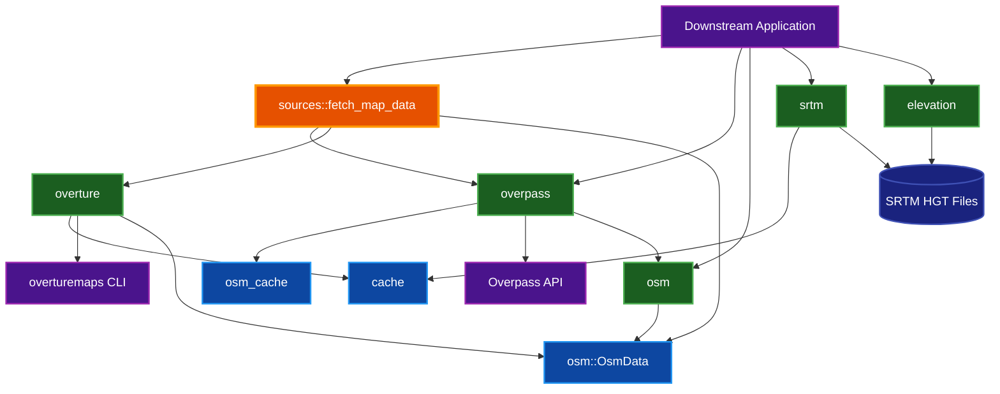
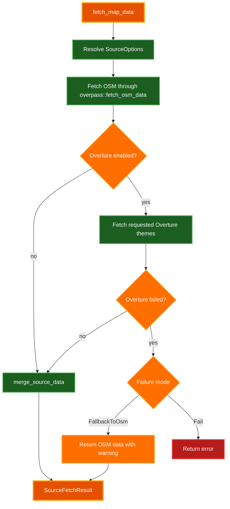
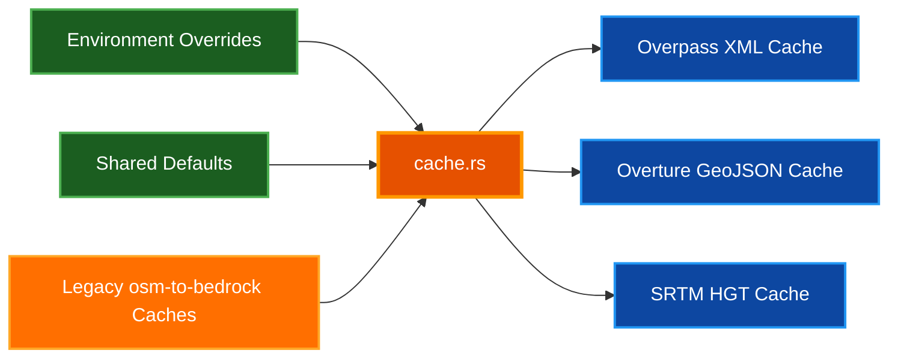

# Architecture

System design and module organization for `par-osm-rust` — a shared Rust crate for fetching, caching, parsing, and normalizing OpenStreetMap-compatible map data.

## Table of Contents

- [Overview](#overview)
- [System Architecture](#system-architecture)
- [Module Layout](#module-layout)
- [Source Orchestration](#source-orchestration)
- [Cache Architecture](#cache-architecture)
- [Data Model](#data-model)
- [Overpass Integration](#overpass-integration)
- [Overture Maps Integration](#overture-maps-integration)
- [Elevation and SRTM](#elevation-and-srtm)
- [Security Boundaries](#security-boundaries)
- [Operational Notes](#operational-notes)
- [Tradeoffs](#tradeoffs)
- [Related Documentation](#related-documentation)

## Overview

**Purpose:** `par-osm-rust` gives OSM-consuming applications one shared data-source layer for Overpass, optional Overture Maps data, raw cache management, OSM XML/PBF parsing, SRTM downloads, and HGT elevation lookup.

**Key design goals:**

- Keep source fetching, cache layout, and parsing behavior consistent across downstream projects.
- Keep application-specific rendering, UI, Minecraft, WGPU, and game logic out of the crate.
- Make source orchestration explicit: OSM is the baseline source; Overture is opt-in and policy-driven.
- Preserve safe defaults for network access, cache migration, and fallback behavior.

**Tech stack:** Rust 2024, blocking `reqwest`, `osmpbf`, `quick-xml`, `serde`, optional `overturemaps` CLI, SRTM HGT files.

## System Architecture

`par-osm-rust` sits between applications and external map/elevation providers. Applications call high-level source APIs when they want shared policy, or lower-level modules when they need direct control.

## Module Layout

| Module | Responsibility |
| --- | --- |
| `lib.rs` | Public module exports and crate-level usage documentation |
| `filter.rs` | `FeatureFilter` flags that control Overpass query categories |
| `overpass.rs` | Overpass URL validation, query construction, HTTP fetch, and cache-aware OSM fetch |
| `osm_cache.rs` | Endpoint-aware raw Overpass XML cache keys, reads, writes, and containment lookups |
| `overture.rs` | Optional `overturemaps` CLI integration, GeoJSON cache, and Overture-to-OSM normalization |
| `sources.rs` | High-level OSM/Overture orchestration, fallback policy, POI modes, and dedupe |
| `osm.rs` | Normalized OSM data structures, XML/PBF parsing, merging, and XML serialization |
| `cache.rs` | Shared cache root resolution and legacy cache migration |
| `srtm.rs` | SRTM tile naming, tile discovery, downloading, and cache location |
| `elevation.rs` | HGT tile parsing and bilinear elevation sampling |

## Source Orchestration

Use `sources::fetch_map_data` when an application wants the shared policy for OSM plus optional Overture data.

`SourceOptions::default()` performs an OSM-only fetch. `PoiSourceMode::OverturePreferred` is the default POI policy, but it does not trigger Overture fetching unless `OvertureParams.enabled` is `true`.

### POI merge policy

`merge_source_data` handles already-loaded data without network or cache I/O. It applies the selected `PoiSourceMode` and dedupes near-duplicate OSM/Overture points by category, normalized name, and distance.

| Mode | Result |
| --- | --- |
| `OsmOnly` | Keep OSM POIs; non-POI Overture geometry can still merge when supplied. |
| `OvertureOnly` | Use Overture POIs; clear OSM POIs if Overture is unavailable. |
| `Both` | Merge OSM and Overture POIs, preferring Overture representatives for duplicates. |
| `OverturePreferred` | Use Overture POIs when present; fall back to OSM POIs otherwise. |

## Cache Architecture

The crate separates cache root resolution from data-specific cache behavior.

Default cache locations live under `~/.cache/par-osm-rust`. Environment overrides take precedence for each data type:

| Data | Resolution priority |
| --- | --- |
| Overpass XML | `PAR_OSM_OVERPASS_CACHE_DIR`, then `OVERPASS_CACHE_DIR`, then shared default |
| Overture GeoJSON | `PAR_OSM_OVERTURE_CACHE_DIR`, then `OVERTURE_CACHE_DIR`, then shared default |
| SRTM HGT | `PAR_OSM_SRTM_CACHE_DIR`, then `SRTM_CACHE_DIR`, then shared default |

Legacy `osm-to-bedrock` cache directories are migrated into the shared default location only when an application explicitly calls `cache::migrate_legacy_caches()` once at startup. The `overpass_cache_dir`, `srtm_cache_dir`, and `overture_cache_dir` getters are pure path resolution and never migrate — keeping accessors side-effect-free and eliminating the first-call race between concurrent callers. Migration always targets the default shared location regardless of any `PAR_OSM_*_CACHE_DIR` / `*_CACHE_DIR` override; override directories are never touched.

## Data Model

`osm::OsmData` is the normalized interchange format for downstream applications.

| Field | Purpose |
| --- | --- |
| `nodes` | OSM and synthetic node coordinates keyed by ID |
| `ways` | Ordered way geometry with tags |
| `ways_by_id` | Lookup index for relation member resolution |
| `relations` | Multipolygon relations and member roles |
| `bounds` | Optional dataset bounding box |
| `poi_nodes` | Renderable points of interest |
| `addr_nodes` | Standalone address nodes |
| `tree_nodes` | Individual tree points |

`osm::FeatureSource` tracks whether features came from OSM, Overture, or synthetic generation. Overture geometry receives synthetic negative node IDs to avoid collisions with real OSM IDs.

## Overpass Integration

`overpass.rs` owns the Overpass HTTP boundary.

**Responsibilities:**

- Validate endpoint URLs before network access.
- Build Overpass QL from a bounding box and `FeatureFilter`.
- Send blocking HTTP requests with a crate-specific user agent.
- Return readable errors for busy or failing Overpass responses.
- Use URL-aware cache keys so different Overpass endpoints do not share stale raw XML.

Applications that run async event loops should call Overpass fetches from a blocking worker thread.

## Overture Maps Integration

`overture.rs` treats Overture as an optional runtime integration. The Rust crate does not depend on the Python package at compile time.

**Runtime boundary:**

1. Check availability with `overture::is_cli_available()`.
2. Invoke `overturemaps download` for requested themes.
3. Cache GeoJSON output under the Overture cache directory.
4. Normalize Overture features into `OsmData`.
5. Let `sources.rs` apply source and POI policy.

> **Note:** Missing Overture support is not an error when callers use `OvertureFailureMode::FallbackToOsm`. The returned `SourceFetchResult` carries warnings so applications can surface degraded behavior without failing the whole fetch.

## Elevation and SRTM

`srtm.rs` maps a geographic bounding box to the needed SRTM tiles, downloads missing `.hgt` files, and resolves the SRTM cache directory. `elevation.rs` reads HGT data and samples elevations.

The elevation path is intentionally independent from OSM source orchestration. Callers decide whether terrain elevation is required for their workload.

## Security Boundaries

| Boundary | Protection |
| --- | --- |
| Overpass URL | HTTPS-only, no userinfo, approved host allowlist |
| Cache path overrides | Environment variables select directories, but no cache content is trusted as executable code |
| Overture CLI | Optional external process with per-command timeout and stderr truncation |
| Synthetic IDs | Negative ID range avoids collisions with positive OSM IDs |
| Secrets | The crate does not require secrets for normal fetch, parse, cache, or publish-time operation |

## Operational Notes

- Keep Overture disabled by default unless a caller explicitly opts in.
- Prefer `sources::fetch_map_data` for application-facing source policy so downstream projects stay consistent.
- Use endpoint-aware cache helpers for new Overpass fetch paths.
- Run `cargo publish --dry-run` before publishing a new crate version.
- Use the manual GitHub Actions publishing workflow rather than automatic publish-on-push.

## Tradeoffs

| Choice | Benefit | Cost |
| --- | --- | --- |
| Blocking HTTP API | Simple synchronous crate API for CLI and renderer setup code | Async applications must use blocking worker threads |
| Optional Overture CLI | Avoids a heavy compile-time Overture dependency | Runtime availability and CLI failures must be handled |
| URL-aware raw XML cache | Prevents stale cross-endpoint cache reuse | Cache keys include more inputs and require endpoint metadata |
| Shared cache root | Lets multiple projects reuse downloads | Requires legacy migration and override precedence rules |
| `OsmData` as interchange format | Downstream projects consume one normalized model | Some source-specific details are intentionally flattened |

## Related Documentation

- [Project README](../README.md) - Usage, examples, cache behavior, and verification commands
- [Documentation Style Guide](DOCUMENTATION_STYLE_GUIDE.md) - Documentation structure, tone, and diagram standards
- [Crates.io publishing workflow](../.github/workflows/publish-crates.yml) - Manual release workflow
- [CI workflow](../.github/workflows/ci.yml) - Format, lint, and test checks
